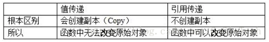

## StockoverflowRestful API
### 吾生也有涯，而知也无涯
| 版本号 | 修改人          | 修改日期   | 修改内容    |
| ------ | --------------- | ---------- | ----------- |
| v1.0   | shanYueFenCheng | 2019-05-06 | Restful文档 |

### 说明

翻译Stackoverflow的问题与答案，参考谷歌翻译，结合中文，保留原意的基础上有精简，代码风格贴近中文，仅用于分享和学习，有什么错误，请多多指教

### Java是“通过引用传递”还是“值传递”？

一直认为Java是传递引用。但是,它不是你看到的样子

[原文](https://stackoverflow.com/questions/40480/is-java-pass-by-reference-or-pass-by-value )

#### 获得认同最多的回答

Java一直都是**按值传递**。然而，当传递一个对象的值，我们却是通过引用来传递的，初学者往往会感到疑惑。

#### 首先，按值传递和按引用传递到底有什么不同


例如：

```java

public class Test {
    public static void main(String[] args) {
        Dog oldDog = new Dog("oldName");
        Dog newDog = oldDog;

        //传递oldDog对象给nonChangeName
        nonChangeName(oldDog);

        //true
        oldDog.getName().equals("oldName");
        //false
        oldDog.getName().equals("newName");
        //true
        System.out.println("是否是一个对象" + (newDog == oldDog));
    }

    private static void nonChangeName(Dog dog) {
        //true oldDog的引用的值被复制传递了一份到dog
        dog.getName().equals("oldName");

        //改变 nonChangeName（）里面的dog指向一个新的Dog实例“newName”
        //改变引用备份的值，只是备份变了，原来oldDog的引用不变
        dog = new Dog("newName");

        //true
        dog.getName().equals("newName");
    }

}

class Dog{
    private String name;
    public String getName() {
        return name;
    }
    public void setName(String name) {
        this.name = name;
    }

    public Dog(String name) {
        this.name = name;
    }
}
```

例子中，因为对象引用是按值传递的，只是old备份被改变了。

如果它是通过引用传递的，oldDog.getName（）应该是newName。

oldDog的引用的值被复制传递了一份到dog，改变引用备份的值，只是备份变了，原来oldDog的引用不变。


另一个例子

```java

public class Test2 {
    public static void main(String[] args) {
        Dog oldDog = new Dog("oldName");
        Dog newDog = oldDog;

        //改变了name值
        isChangeName(oldDog);

        //true
        oldDog.getName().equals("newName");
        //false
        oldDog.getName().equals("oldName");

        //true 虽然改变了对象的值，但是对象的引用的值一直都没有变过
        System.out.println(newDog == oldDog);
    }

    private static void isChangeName(Dog dog) {
        //true oldDog的引用的值被复制传递了一份到dog
        dog.getName().equals("oldName");

        //isChangeName（）里面的dog是引用备份，但是和oldDog原引用指向同一个对象
        //通过引用找到对象，然后赋值newName
        dog.setName("newName");
    }
}

class Dog{
    private String name;
    public String getName() {
        return name;
    }
    public void setName(String name) {
        this.name = name;
    }

    public Dog(String name) {
        this.name = name;
    }
}
```

例子中，因为对象引用是还是按值传递的，isChangeName（）里面的dog是引用备份。

但是，和oldDog原引用指向同一个对象，通过引用--对象，然后赋新的名字newName。

虽然改变了对象的值，但是对象的引用的值一直都没有变过

[上一篇：**为什么有空指针异常 该如何解决**](https://github.com/LucaceLC/StackoverflowJavaQuestion/blob/master/%E7%A9%BA%E6%8C%87%E9%92%88%E5%BC%82%E5%B8%B8/%E3%80%90%E7%A9%BA%E6%8C%87%E9%92%88%E5%BC%82%E5%B8%B8%E3%80%91%E3%80%900%E3%80%91%E3%80%90%E4%B8%BA%E4%BB%80%E4%B9%88%E6%9C%89%E7%A9%BA%E6%8C%87%E9%92%88%E5%BC%82%E5%B8%B8%20%E8%AF%A5%E5%A6%82%E4%BD%95%E8%A7%A3%E5%86%B3%E3%80%91.md)